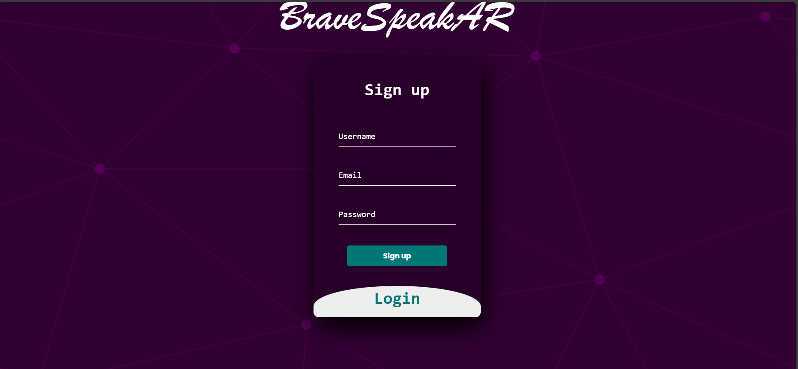
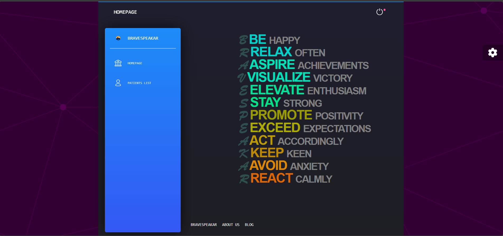
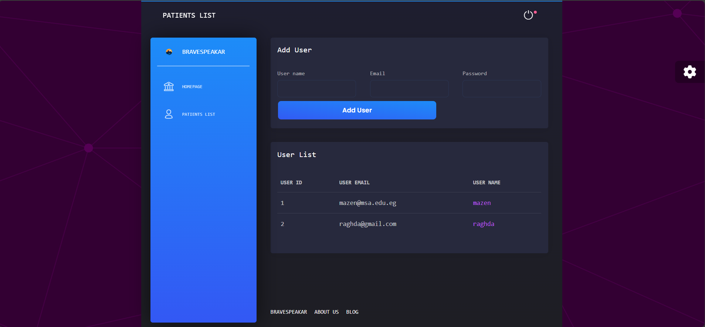
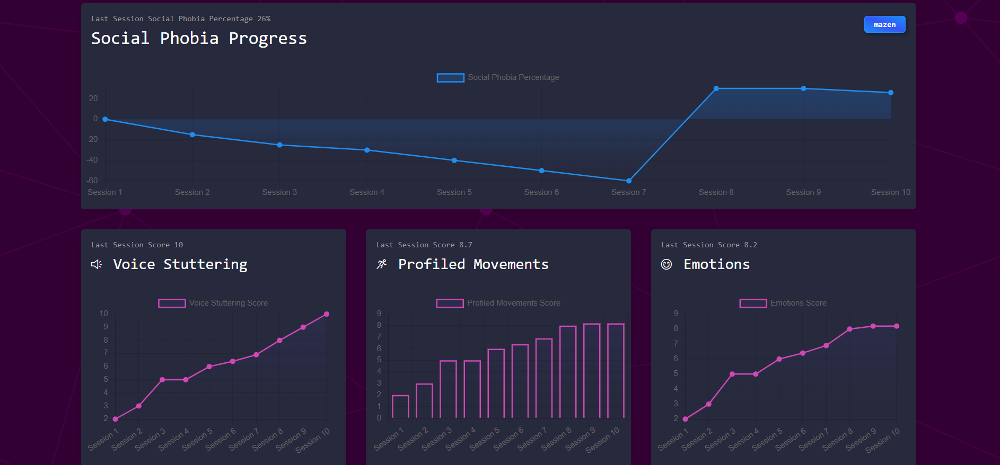
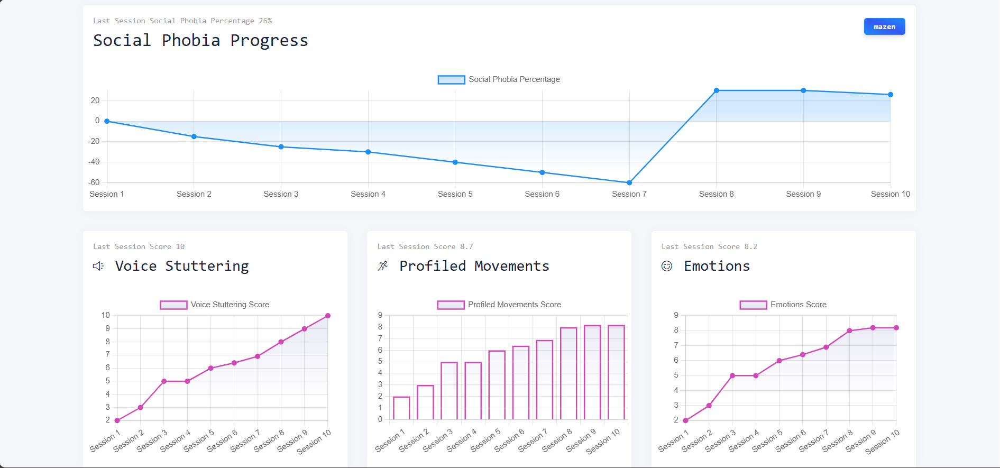

# BraveSpeakAR

Welcome to the BraveSpeakAR project repository! BraveSpeakAR is designed to provide an innovative approach to speech and language therapy, leveraging the power of Augmented Reality (AR) to create engaging and effective therapeutic activities.

## Introduction

BraveSpeakAR aims to assist individuals in overcoming speech and language barriers through interactive AR-based exercises and games. Our mission is to make speech therapy accessible, enjoyable, and efficient for everyone in need.

## Features

- **Interactive AR Activities:** Engage with speech therapy exercises in an immersive AR environment.
- **Personalized Therapy Sessions:** Tailored exercises that cater to the specific needs and progress of the user.
- **Progress Tracking:** Monitor improvements and achievements through a user-friendly interface.
- **Accessible Anywhere:** Use the application anywhere, anytime, without the need for specialized equipment.

## UI/UX


Here are some screenshots and mockups of the BraveSpeakAR application:

### Login/SignUp Screen


### Home Screen


### Patient CRUD Screen


### Patient CRUD Screen (Dark Theme)


### Charts Screen (Light Theme)


## Getting Started

These instructions will get you a copy of the project up and running on your local machine for development and testing purposes.

### Prerequisites

What you need to install the software:

- [Node.js](https://nodejs.org/)
- [React Native](https://reactnative.dev/)
- AR-compatible hardware (e.g., ARCore/ARKit supported devices)

### Installation

```sh
# Clone the repository
git clone https://github.com/Mstf000/BraveSpeakAR.git
cd BraveSpeakAR

# Set up the Python environment
# Open the project in PyCharm
# Set up a virtual environment in PyCharm:
# Go to File > Settings > Project: BraveSpeakAR > Python Interpreter.
# Select an existing interpreter or create a new virtual environment.
# Install the required Python libraries:
pip install -r requirements.txt

# Run the backend
# In PyCharm, locate app.py in the project explorer.
# Run app.py:
# Right-click on app.py and select Run 'app'.
# Alternatively, you can use the terminal:
python app.py

# Navigate to the client directory
cd client

# Install Node modules
npm install

# Start the frontend development server
npm start

```
## Usage


## Contributing

We welcome contributions to BraveSpeakAR! If you have suggestions for improvement or want to contribute to the project, please feel free to:

1. Fork the project
2. Create your feature branch (`git checkout -b feature/AmazingFeature`)
3. Commit your changes (`git commit -m 'Add some AmazingFeature'`)
4. Push to the branch (`git push origin feature/AmazingFeature`)
5. Open a Pull Request

## License

Distributed under the MIT License. See `LICENSE` for more information.

## Contact

Mazen Walid - [@Mazen Walid](https://www.linkedin.com/in/mazen-walid-225582208/)
Mostafa Ameen - [@Mostafa Ameen](https://www.linkedin.com/in/mostafa-ameen-72511a1bb/)

In Progress Project Link: [https://github.com/Mstf000/BraveSpeakAR](https://github.com/Mstf000/BraveSpeakAR)

Stable Version Till Now : https://github.com/mazen251/BraveSpeakAR
